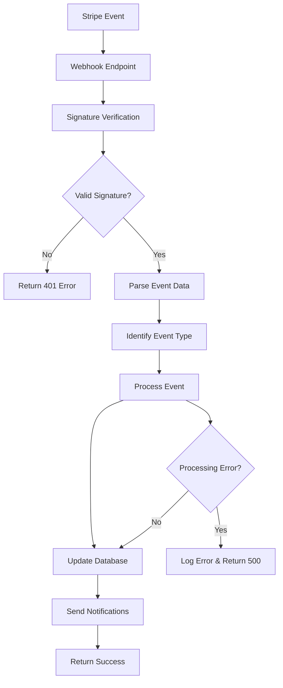

# Stripe Webhook Implementation Guide

## Overview

This document describes the comprehensive Stripe webhook implementation for the Astral Draft Oracle platform, including payment confirmations, subscription management, and refund processing.

## 🔧 Implementation Components

### 1. Enhanced Webhook Endpoint (`backend/routes/payment.ts`)

**Endpoint:** `POST /api/payment/webhook`

**Features:**
- ✅ Stripe signature verification
- ✅ Timestamp validation (prevents replay attacks)
- ✅ Comprehensive error handling
- ✅ Event logging and monitoring
- ✅ Processing time tracking
- ✅ Event type identification

**Security Measures:**
- Signature verification using `STRIPE_WEBHOOK_SECRET`
- Timestamp tolerance checking
- Raw body parsing to preserve signatures
- Error classification (signature, timestamp, processing)

### 2. Payment Service Webhook Handler (`services/paymentService.ts`)

**Supported Events:**
- `payment_intent.succeeded` - Contest entry payments
- `customer.subscription.created` - New subscriptions
- `customer.subscription.updated` - Subscription changes
- `customer.subscription.deleted` - Subscription cancellations
- `invoice.payment_succeeded` - Recurring payments
- `invoice.payment_failed` - Failed payments
- `charge.dispute.created` - Payment disputes/chargebacks

### 3. Database Integration (`backend/db/payment-schema.ts`)

**Tables Updated:**
- `user_subscriptions` - Subscription status tracking
- `payment_history` - All payment records
- `contest_entries` - Contest participation
- `user_billing` - Customer information

### 4. Testing Infrastructure

**Webhook Testing Service:** `services/webhookTestingService.ts`
- Comprehensive test suite for all webhook events
- Security testing (signature validation, timestamp checks)
- Performance monitoring
- Error handling verification

**Simple Test Runner:** `simple-webhook-test.js`
- Basic webhook event testing
- Signature verification examples
- Stripe CLI command reference

## 🚀 Setup Instructions

### 1. Environment Variables

```bash
# Stripe Configuration
STRIPE_SECRET_KEY=sk_test_...
STRIPE_PUBLISHABLE_KEY=pk_test_...
STRIPE_WEBHOOK_SECRET=whsec_...

# Database
DB_PATH=./data/astral-draft.db
```

### 2. Webhook Endpoint Configuration

**Development URL:** `http://localhost:3001/api/payment/webhook`
**Production URL:** `https://yourdomain.com/api/payment/webhook`

### 3. Stripe Dashboard Setup

1. Go to [Stripe Dashboard](https://dashboard.stripe.com/webhooks)
2. Click "Add endpoint"
3. Enter your webhook URL
4. Select events to listen for:
   - `payment_intent.succeeded`
   - `customer.subscription.created`
   - `customer.subscription.updated`
   - `customer.subscription.deleted`
   - `invoice.payment_succeeded`
   - `invoice.payment_failed`
   - `charge.dispute.created`
5. Copy the webhook signing secret to `STRIPE_WEBHOOK_SECRET`

## 🧪 Testing Guide

### Local Testing with Stripe CLI

1. **Install Stripe CLI:**
   ```bash
   # macOS
   brew install stripe/stripe-cli/stripe
   
   # Windows
   # Download from https://stripe.com/docs/stripe-cli
   ```

2. **Login to Stripe:**
   ```bash
   stripe login
   ```

3. **Forward webhooks to local server:**
   ```bash
   stripe listen --forward-to localhost:3001/api/payment/webhook
   ```

4. **Trigger test events:**
   ```bash
   # Payment confirmation
   stripe trigger payment_intent.succeeded
   
   # Subscription events
   stripe trigger customer.subscription.created
   stripe trigger customer.subscription.updated
   stripe trigger customer.subscription.deleted
   
   # Invoice events
   stripe trigger invoice.payment_succeeded
   stripe trigger invoice.payment_failed
   
   # Dispute/refund
   stripe trigger charge.dispute.created
   ```

### Automated Testing

1. **Run webhook test suite:**
   ```bash
   node simple-webhook-test.js
   ```

2. **Test with custom data:**
   ```bash
   stripe trigger payment_intent.succeeded --add payment_intent:amount=1000
   ```

## 📊 Webhook Event Handling

### Payment Intent Succeeded
**Event:** `payment_intent.succeeded`
**Purpose:** Confirm contest entry payments
**Actions:**
- Update payment status in database
- Create contest entry record
- Send confirmation email
- Update user balance

### Subscription Created
**Event:** `customer.subscription.created`
**Purpose:** Track new premium subscriptions
**Actions:**
- Create subscription record
- Update user tier
- Grant premium features
- Send welcome email

### Subscription Updated
**Event:** `customer.subscription.updated`
**Purpose:** Handle subscription changes
**Actions:**
- Update subscription status
- Modify feature access
- Handle trial-to-paid transitions
- Process plan changes

### Subscription Deleted
**Event:** `customer.subscription.deleted`
**Purpose:** Handle cancellations
**Actions:**
- Revoke premium features
- Update user tier to free
- Send cancellation confirmation
- Retain data per retention policy

### Invoice Payment Succeeded
**Event:** `invoice.payment_succeeded`
**Purpose:** Confirm recurring payments
**Actions:**
- Extend subscription period
- Update payment history
- Send receipt
- Reset usage limits

### Invoice Payment Failed
**Event:** `invoice.payment_failed`
**Purpose:** Handle failed payments
**Actions:**
- Mark subscription as past due
- Send payment failure notification
- Initiate retry sequence
- Potentially downgrade features

### Charge Dispute Created
**Event:** `charge.dispute.created`
**Purpose:** Handle payment disputes
**Actions:**
- Flag disputed payment
- Gather evidence
- Notify admin team
- Temporarily freeze account

## 🔒 Security Best Practices

### 1. Signature Verification
```javascript
// Always verify webhook signatures
const signature = req.headers['stripe-signature'];
const event = stripe.webhooks.constructEvent(body, signature, webhookSecret);
```

### 2. Idempotency
```javascript
// Handle duplicate events
const existingEvent = await getProcessedEvent(event.id);
if (existingEvent) {
  return res.json({ received: true, duplicate: true });
}
```

### 3. Error Handling
```javascript
// Graceful error handling
try {
  await processWebhookEvent(event);
} catch (error) {
  console.error('Webhook processing failed:', error);
  // Return 500 to trigger Stripe retry
  return res.status(500).json({ error: 'Processing failed' });
}
```

### 4. Logging
```javascript
// Comprehensive logging
console.log(`Webhook received: ${event.type} (${event.id})`);
console.log(`Processing time: ${processingTime}ms`);
```

## 📈 Monitoring and Alerting

### Key Metrics to Monitor
- Webhook processing time
- Error rates by event type
- Failed signature verifications
- Duplicate event handling
- Database operation success rates

### Recommended Alerts
- Webhook processing failures > 5%
- Signature verification failures
- Processing time > 5 seconds
- Database connection errors
- Subscription status inconsistencies

### Logging Best Practices
```javascript
// Structure logs for monitoring tools
const logData = {
  timestamp: new Date().toISOString(),
  eventType: event.type,
  eventId: event.id,
  processingTime,
  success: true,
  userId: metadata.userId,
  customerId: event.data.object.customer
};
console.log(JSON.stringify(logData));
```

## 🚨 Troubleshooting

### Common Issues

1. **Invalid Signature Errors**
   - Check `STRIPE_WEBHOOK_SECRET` environment variable
   - Ensure raw body parsing is enabled
   - Verify webhook endpoint URL in Stripe Dashboard

2. **Timestamp Tolerance Errors**
   - Check server time synchronization
   - Verify webhook retry attempts
   - Review Stripe webhook delivery logs

3. **Duplicate Event Processing**
   - Implement idempotency checks
   - Use event IDs to track processed events
   - Consider database unique constraints

4. **Database Connection Errors**
   - Check database connectivity
   - Verify connection pool settings
   - Monitor database performance

### Debug Commands
```bash
# Check webhook deliveries in Stripe Dashboard
# Look for failed attempts and error messages

# Test webhook endpoint directly
curl -X POST http://localhost:3001/api/payment/webhook \
  -H "stripe-signature: test_signature" \
  -H "content-type: application/json" \
  -d '{"test": "data"}'

# Monitor webhook logs
tail -f logs/webhook.log
```

## 📋 Production Checklist

### Pre-Deployment
- [ ] Environment variables configured
- [ ] Webhook endpoint accessible via HTTPS
- [ ] Database schema deployed
- [ ] Error monitoring configured
- [ ] Logging infrastructure ready

### Stripe Dashboard Configuration
- [ ] Production webhook endpoint configured
- [ ] Correct events selected
- [ ] Webhook signing secret copied
- [ ] Test mode disabled for production

### Testing
- [ ] All webhook events tested
- [ ] Security measures verified
- [ ] Error handling validated
- [ ] Performance benchmarks met

### Monitoring
- [ ] Webhook delivery monitoring enabled
- [ ] Error alerting configured
- [ ] Performance metrics tracked
- [ ] Log aggregation setup

## 🔄 Webhook Event Flow



## 📚 Additional Resources

- [Stripe Webhooks Documentation](https://stripe.com/docs/webhooks)
- [Stripe CLI Documentation](https://stripe.com/docs/stripe-cli)
- [Webhook Security Best Practices](https://stripe.com/docs/webhooks/best-practices)
- [Stripe Event Types Reference](https://stripe.com/docs/api/events/types)

---

**Last Updated:** August 10, 2025
**Version:** 1.0.0
**Author:** Astral Draft Development Team
